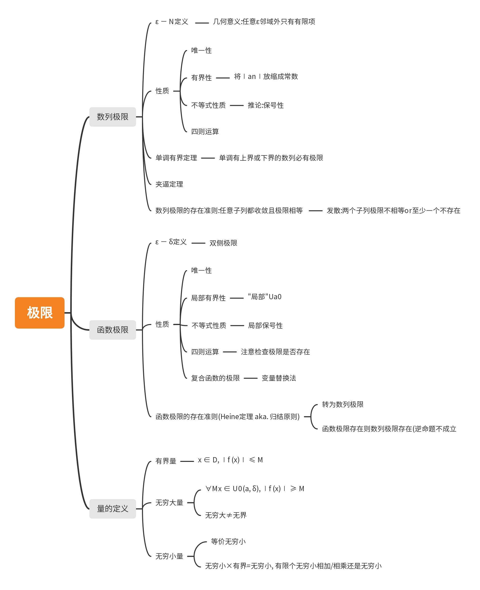
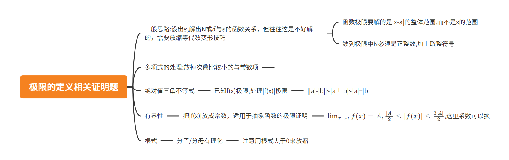
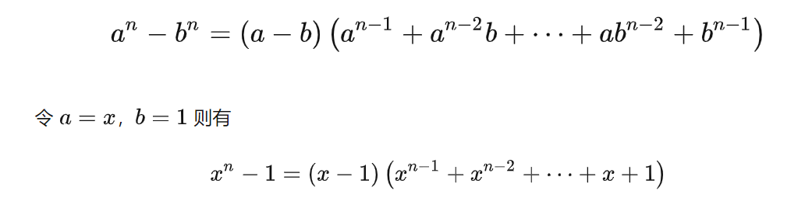
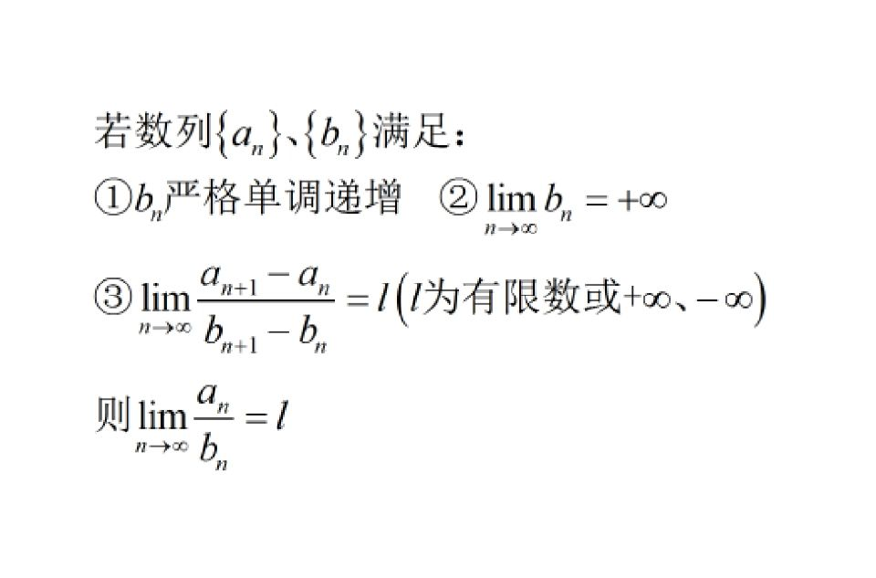
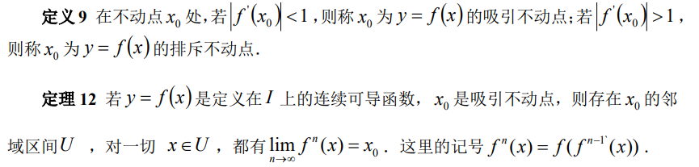

# 极限总结

[TOC]

## 框架

  

## 极限的定义

   

>证明 $\lim_{x \to 1}(x^2+1)=2$

$$|x+1||x-1|<\varepsilon$$ 
(这种题目化简后都能提出|x-a|因子,现在只需要把其他的放缩掉就好了)

由于$x \to 1$,不妨设 $|x-1|\leq \frac{1}{2}$,则$|x+1| \geq \frac{5}{2}$ (注意不等号方向),

$|x-1|<\varepsilon/\frac{5}{2}$,取$\delta = \min\{\frac{1}{2},\varepsilon/\frac{5}{2}\}$  (注意要取放缩的min)
 
>证明$\lim_{x \to a} f(x)=A$,则$\lim_{x \to a}|f(x)|=|A|$

$$||a|-|b||<|a\pm b|<|a|+|b|$$
所以
 $$||f(x)|-|A||<|f(x)-A| <\varepsilon$$

## 夹逼定理的应用技巧

n方差:
  

常见不等式:

$n$元均值: $\sqrt[n]{x_1x_2\dots x_n}<\frac{x_1+x_2+\dots+x_n}{n}$ 

**看到n次方根**,比如$\sqrt[n]{a}=\sqrt[n]{a\cdot1\cdot1....}<\frac{a+n-1}{n}$,还可以把a拆成2个,3个...

## 和式的极限

### Stolz定理

适用于分子或分母**有一个**是和式

  

### 应用夹逼定理

选最小/最大的项,换成能求和的形式
- 构造裂项
- 直接×n

## 递推数列的极限

$$x_{n+1}=f(x_n)$$

1. 首先假设数列收敛，极限为$A$. 两边取极限得$A=f(A)$,解出不动点A(A可能有多个，结合有界性先舍去一些，或者画蛛网图观察)不是每个不动点都有用) 如果发现是吸引不动点，那么大概率可猜答案
  

2. 数列是否单调?
   2.2 若单调，见[单调有界定理](#单调有界定理)

   2.3 如果不单调，考虑构造 $|x_{n+1}-A|<q|x_n -A|$等有关$|x_n -A|$的式
### 单调有界定理

#### 单调

- 作差/做比,如果难以直接看出和0,1的大小关系，**可用比值/差的极限来证明单调性**。如$\lim_{n \to \infin}{(a_n/a_{n-1})}=k<1$,由极限不等式性质,$\exist N,n>N$时$a_n/a_{n-1}<1$,说明$n>N$时单调递减,例如阶乘型做比中出现$(n+1)/(2n+1)$

- **利用数学归纳法**,假设$x_k<x_{k+1}$

>例$x_{n+1} =\sqrt{x_n+3}$

显然$x_1<x_2$,假设$x_k < x_{k+1}$

$x_k+3<x_{k+1}+3$

两边开根号得$\sqrt{x_k+3}<\sqrt{x_{k+1}+3}$，即$x_{k+1}<x_{k+2}$

#### 有界

- **注意恒正/恒为负**
- **先猜出界，再归纳**(结合 $f(x)$ 的单调性),比如$x_1<A$,$x_2<A$ (注意结合题目条件，如初始值等等)

[总结](https://www.cnblogs.com/0202zc/p/13269846.html)

## 数列极限的存在性

数列收敛的充要条件:任意子列都收敛且极限相等 
发散:取一个子列极限存在但不相等，或一个子列不收敛

Cauchy收敛准则:$\forall \varepsilon \exist N,\forall n>N,\forall p,|a_{n+p}-a_n|<\varepsilon$

推论:数列收敛的一些充分条件:
 $|x_{n+1}-A|<q|x_n -A| (0<q<1)$
 $|x_n -A|<q^n (0<q<1)$
## 无穷小量与无穷大量

### 等价无穷小
注意区分等价与$o$记号: $\lim_{x \to 0}\frac{f(x)}{g(x)}$,等于1是等价~，等于0是$f(x)=o(g(x))$

$x \to 0$
$$x \sim e^{x}-1 ; x \ln a \sim a^{x}-1$$
$$x \sim \ln (1+x) ; \frac{x}{\ln a} \sim \log _{a}(1+x)$$
$$x \sim \sin x \sim \tan x \sim \arcsin x \sim \arctan x$$
$$\frac{1}{2} x^{2} \sim (1-\cos x)$$
$$\lambda x \sim(1+x)^{\lambda}-1$$

运算法则

1. $o\left(x^{n}\right) \pm o\left(x^{n}\right)=o\left(x^{n}\right)$ (同阶加减，阶数不变)

2. 当 $m>n$ 时， $o\left(x^{m}\right) \pm o\left(x^{n}\right)=o\left(x^{n}\right)$ (不同次加减，取次数低)

3. $o\left(x^{m}\right) \cdot o\left(x^{n}\right)=o\left(x^{m+n}\right), x^{m} \cdot o\left(x^{n}\right)=o\left(x^{m+n}\right)$

4. 设 $\varphi(x)$ 有界， $\varphi(x) \cdot o\left(x^{n}\right)=o\left(x^{n}\right)$

5. 注意,$o(x^n)-o(x^n) \neq 0$, $\frac{o(x^m)}{o(x^n)} \neq o(x^{m-n})$
6. $\lim_{x \to 0}\frac{o(x^n)}{x^n}=0$

