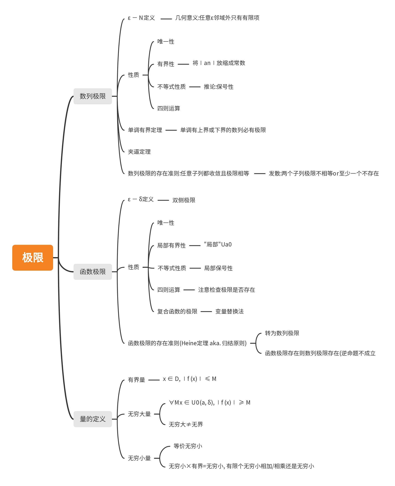
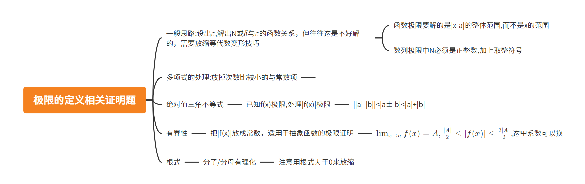
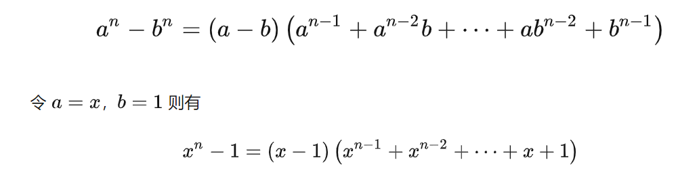
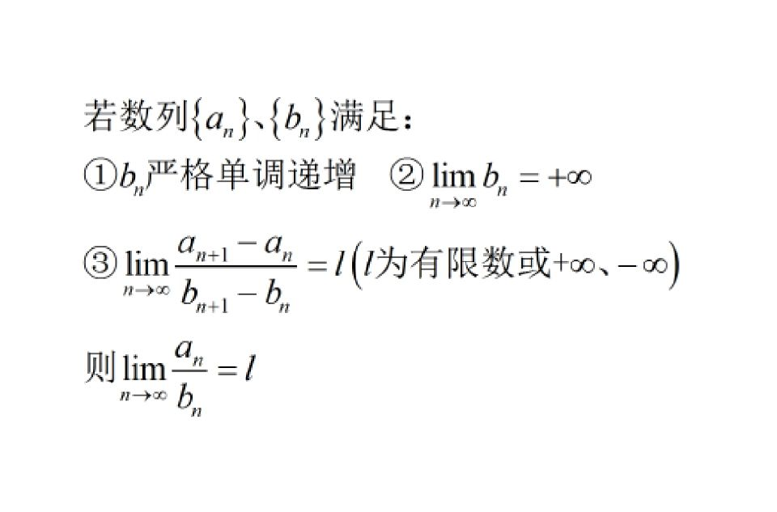

# 极限总结

## 框架

  

## 极限的定义相关证明题

   

>证明 $\lim_{x \to 1}(x^2+1)=2$

$$|x+1||x-1|<\varepsilon$$ 
(这种题目化简后都能提出|x-a|因子,现在只需要把其他的放缩掉就好了)

由于$x \to 1$,不妨设 $|x-1|\leq \frac{1}{2}$,则$|x+1| \geq \frac{5}{2}$ (注意不等号方向),

$|x-1|<\varepsilon/\frac{5}{2}$,取$\delta = \min\{\frac{1}{2},\varepsilon/\frac{5}{2}\}$  (注意要取放缩的min)
 
>证明$\lim_{x \to a} f(x)=A$,则$\lim_{x \to a}|f(x)|=|A|$

$$||a|-|b||<|a\pm b|<|a|+|b|$$
所以
 $$||f(x)|-|A||<|f(x)-A| <\varepsilon$$

## 夹逼定理的应用技巧

有理化:
  

常见不等式:

$n$元均值: $\sqrt[n]{x_1x_2\dots x_n}<\frac{x_1+x_2+\dots+x_n}{n}$

柯西

## 递推数列的极限

$$x_{n+1}=f(x_n)$$

首先假设数列收敛，极限为$A$. 两边取极限得$A=f(A)$,解出A(A可能有多个，结合有界性舍去)

### 单调有界定理

#### 单调

- 作差/做比,如果难以直接看出和0,1的大小关系，**可用比值/差的极限来证明单调性**。如$\lim_{n \to \infin}{(a_n/a_{n-1})}=k<1$,由极限不等式性质,$\exist N,n>N$时$a_n/a_{n-1}<1$,说明$n>N$时单调递减,例如阶乘型做比中出现$(n+1)/(2n+1)$

- **利用数学归纳法**,假设$x_k<x_{k+1}$

>例$x_{n+1} =\sqrt{x_n+3}$

显然$x_1<x_2$,假设$x_k < x_{k+1}$

$x_k+3<x_{k+1}+3$

两边开根号得$\sqrt{x_k+3}<\sqrt{x_{k+1}+3}$，即$x_{k+1}<x_{k+2}>$

#### 有界

- **注意恒正/恒为负**
- 先猜出界，再归纳(结合$f(x)$的单调性)

根据猜出的不动点，设

### Stolz定理

适用于分子或分母**有一个**是和式

  
